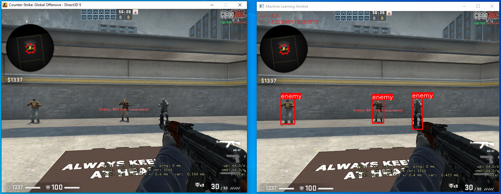

# GAN-Aimbot

GAN-Aimbot is a machine learning aimbot for the game
Counter Strike: Global offensive, it makes use of the YOLOv8
image classifier to identify enemy targets in real time.
This data is used to decide where to aim based on the closest enemy.The project was created for my bachelor's project which was about the use of machine learning to create external cheats for first person video games.

